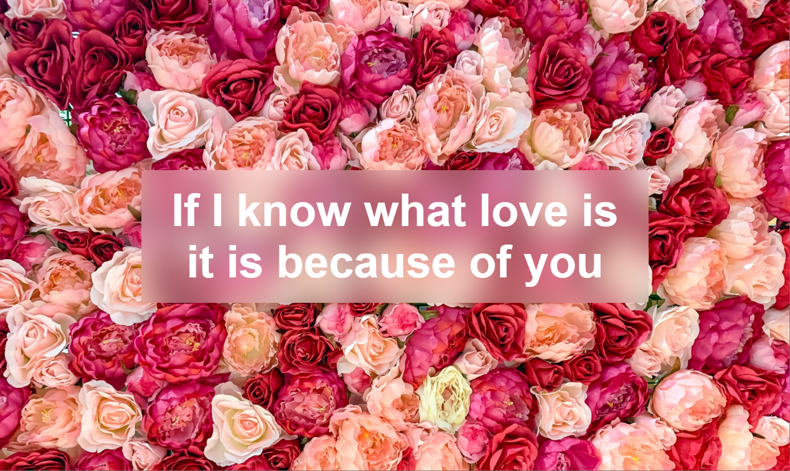

# 冷门、炫酷、牛X的 CSS 特性

## 多列布局（Multi-column Layout）

> [MDN - CSS Multi-column Layout](https://developer.mozilla.org/en-US/docs/Web/CSS/CSS_Columns)

> [Can I Use - CSS3 Multi-column Layout](https://caniuse.com/multicolumn)

CSS 提供了对多列布局的支持。支持设置布局中的列数 (`column-count`)、内容应如何列之间的流动规则、列之间的间距 (`column-gap`) 以及列分割线（`column-rule`）的样式。

比如可以实现下面的瀑布流效果：


[**Codepen demo**](https://codepen.io/mudontire/pen/yLevxRr)

**主要样式：**

```scss
.masonry {
  width: 1440px;
  margin: 20px auto;
  columns: 4;
  column-gap: 30px;

  .item {
    width: 100%;
    break-inside: avoid;
    margin-bottom: 30px;

    img {
      width: 100%;
    }
  }
}
```

## CSS 计数器（Counters）

> [MDN - Using CSS counters](https://developer.mozilla.org/en-US/docs/Web/CSS/CSS_Counter_Styles/Using_CSS_counters)

> [Can I Use - CSS Counters](https://caniuse.com/css-counters)

对页面元素进行自动计数并展示。

比如实现下面的这种多级列表的序号：


**常用方法：**

```
// 初始化一个名称为 <name> 的计数器，设置初始值为 <value>
1. counter-reset: <name> <value>; 

// 给名称为 <name> 的计数器的值增加 <value>
2. counter-increment: <name> <value>; 

// 返回名称为 <name> 的计数器的值，以 <style> 的 list style样式显示
3. counter(<name>, <style>); 
```

## CSS `attr()` 方法

> [MDN - attr()](https://developer.mozilla.org/en-US/docs/Web/CSS/attr)

> [Can I Use - CSS3 attr()](https://caniuse.com/css3-attr)

可以通过CSS的 `attr()` 方法把 HTML 的 attributes 赋值给某些 CSS property。目前正式支持赋值的只有 `content` property，其他 property 还在实验阶段。

**用法：**

**HTML:**
```html
<p data-foo="hello">world</p>
```

**CSS:**
```css
p::before{
  content: attr(data-foo) " ";
}
```

## 书写模式（Writing Modes）

> [MDN - CSS Writing Modes](https://developer.mozilla.org/en-US/docs/Web/CSS/CSS_Writing_Modes)

> [Can I Use - CSS writing-mode property](https://caniuse.com/css-writing-mode)

Writing Modes 定义了各种国际书写模式，例如从左到右（拉丁语、印度语）、从右到左（希伯来语、阿拉伯语）、双向（混合从左到右和从右到左的语言）和垂直（汉语）。

下面是三种书写方式的展示：


[**Codepen demo**](https://codepen.io/mudontire/pen/Yzreqvx)

**关键样式:**

```scss
.left-to-right {
  direction: ltr;
}

.right-to-left {
  direction: rtl;
}

.vertical {
  writing-mode: vertical-rl;
}
```

或者，可以用来实现一个黑客帝国的 code rain：

[**Codepen - Matrix code rain**](https://codepen.io/mudontire/pen/YzreyWL)

## `aspect-ratio` 属性

> [MDN - aspect-ratio](https://developer.mozilla.org/en-US/docs/Web/CSS/aspect-ratio)

> [Can I Use - CSS property: aspect-ratio](https://caniuse.com/mdn-css_properties_aspect-ratio)

CSS 的 `aspect-ratio` 属性用于设置元素的首选宽高比，可以自动计算宽度、高度和其他一些布局功能，省去同时计算宽和高的工作。

比如，视频网站可以设置视频播放窗口比例为 16/9：


[Codepen demo](https://codepen.io/mudontire/pen/mdBXPqB)

**关键样式：**

```scss
.video-box {
  width: 70vw;
  background-color: #000;
  aspect-ratio: 16/9;
}
```

## `gap` 属性

> [MDN - gap](https://developer.mozilla.org/en-US/docs/Web/CSS/gap)

> [Can I Use - gap property for Flexbox](https://caniuse.com/flexbox-gap)

CSS 的 `gap` 属性用于 flex 和 grid 布局时设置行和列之间的间隔，是 `row-gap` 和 `column-gap` 的简写。

以前在使用 flex 布局的时候经常会用 `margin`、`padding` 来控制 flex item 之间的间隔，用 `gap` 会更方便。

比如:

```html
<div class="flex-box">
  <div class="item"></div>
  <div class="item"></div>
  <div class="item"></div>
  <div class="item"></div>
  <div class="item"></div>
  <div class="item"></div>
  <div class="item"></div>
  <div class="item"></div>
  <div class="item"></div>
</div>
```

```scss
.flex-box {
  display: flex;
  width: 400px;
  flex-wrap: wrap;
  gap: 20px;
}

.item {
  width: 120px;
  height: 60px;
  background-color: c·rimson;
}
```


[**Codepen demo**](https://codepen.io/mudontire/pen/ExwQKGK)

## CSS Shapes

> [MDN - CSS Shapes](https://developer.mozilla.org/en-US/docs/Web/CSS/CSS_Shapes)

> [Can I Use - CSS Shapes Level 1](https://caniuse.com/css-shapes)

CSS Shapes 用于描述元素的几何形状。元素的常规形状就是矩形，使用 CSS Shapes 可以将元素定义为圆、椭圆或多边形。

对于 Level 1 规范，CSS Shapes 可以应用于浮动元素。 该规范定义了不同的方法来定义浮动元素上的形状。

比如，实现下面文字环绕圆形图片的效果：


[**Codepen demo**](https://codepen.io/mudontire/pen/eYGVzdz)

**关键样式：**

```scss
img {
  width: 300px;
  float: left;
  shape-outside: circle(50%);
}
```

## `background-attachment`

> [MDN - background-attachment](https://developer.mozilla.org/en-US/docs/Web/CSS/background-attachment)

> [Can I use - CSS background-attachment](https://caniuse.com/background-attachment)

用于设置元素的背景图是否相对于 viewport、自身还是content固定。常用于实现视差滚动效果。

**常用值：**

```css
/* 相对于viewport固定 */
background-attachment: fixed;
/* 相对于元素自身固定，不会随content滚动 */
background-attachment: scroll;
/* 相对于content固定，会随content滚动 */
background-attachment: local;
```

## `object-fit` 属性

> [MDN - object-fit](https://developer.mozilla.org/en-US/docs/Web/CSS/object-fit)

> [Can I Use - CSS3 object-fit/object-position](https://caniuse.com/object-fit)

`object-fit` 属性用于设置 [replaced element](https://developer.mozilla.org/en-US/docs/Web/CSS/Replaced_element)（例如 `` 或 `<video>`）的内容如何适配其容器的尺寸。

比如，调整一张图片在容器里面的显示：


[**Codepen demo**](https://codepen.io/mudontire/pen/BawYJrQ)

## `filter` 属性

> [MDN - filter](https://developer.mozilla.org/en-US/docs/Web/CSS/filter)

> [Can I Use - CSS Filter Effects](https://caniuse.com/css-filters)

CSS 的 `filter` 属性将图像的效果调整（模糊、对比度、灰度、色调等）应用于元素。`filter` 通常用于调整图像、背景和边框的渲染。

比如，每年的国家公祭日很多网站会把颜色调整成黑白，就可以用 `filter` 一行代码搞定：


**常用方法**

```scss
filter: blur(5px);
filter: brightness(0.4);
filter: contrast(200%);
filter: drop-shadow(16px 16px 20px blue);
filter: grayscale(50%);
filter: hue-rotate(90deg);
filter: invert(75%);
filter: opacity(25%);
filter: saturate(30%);
filter: sepia(60%);
```

[Filters on image](https://codepen.io/mudontire/pen/MWYWpoG)

[CSS 3D tunnel](https://codepen.io/mudontire/pen/OJQzjWm)

## `backdrop-filter` 属性

与 `filter` 类似的属性，`backdrop-filter` 属性将图形效果（例如模糊或颜色偏移）应用于元素的背景区域。 因为它适用于元素后面的所有内容，使用时需要将元素或其背景至少部分设置为透明才能看到效果。

> [MDN - backdrop-filter](https://developer.mozilla.org/en-US/docs/Web/CSS/backdrop-filter)

> [Can I Use - CSS Backdrop Filter](https://caniuse.com/css-backdrop-filter)

比如，可以用它做一个毛玻璃的效果：



[**Codepen demo**](https://codepen.io/mudontire/pen/dyVdqow)

**关键代码：**

```html
<div class="box">
  <p>
    If I know what love is
    <br />it is because of you
  </p>
</div>
```

```scss
.box {
  background: url(../images/roses.jpg) no-repeat;
}

p {
  background-color: rgba(255, 255, 255, 0.3);
  backdrop-filter: blur(20px);
  color: white;
}
```

## `conic-gradient()` 函数

> [MDN - conic-gradient()](<https://developer.mozilla.org/en-US/docs/Web/CSS/gradient/conic-gradient()>)

> [Can I Use - conic-gradient()](https://caniuse.com/mdn-css_types_image_gradient_conic-gradient)

CSS 中的 `linear-gradient()` 函数大家应该接触的不少，除此之外 gradient 家族中还有 `radial-gradient()`、`conic-gradient()` 等，更多类型可参考 [MDN - gradient](https://developer.mozilla.org/en-US/docs/Web/CSS/gradient)。

`conic-gradient()` 函数创建一个图像，该图像由渐变色组成，颜色围绕中心点旋转过渡（而不是从中心辐射）。

例如，常见的渐变色仪表盘图表就可以用 `conic-gradient()` 函数绘制：


[**Codepen demo**](https://codepen.io/mudontire/pen/LYzQJLq)

## `radial-gradient()` 函数

> [MDN - radial-gradient()](https://developer.mozilla.org/en-US/docs/Web/CSS/gradient/radial-gradient)

> [Can I Use - radial-gradient()](https://caniuse.com/mdn-css_types_image_gradient_radial-gradient)

`radial-gradient()` 用于产生一个从中心向外辐射的渐变色图像。

## `repeating-linear-gradient()` 函数

> [MDN - repeating-linear-gradient()](https://developer.mozilla.org/en-US/docs/Web/CSS/gradient/repeating-linear-gradient)

> [Can I Use - repeating-linear-gradient()](https://caniuse.com/mdn-css_types_image_gradient_repeating-linear-gradient)

`repeating-linear-gradient()` 用于产生一个重复的线性渐变色图像。

## `accent-color` 属性

> [MDN - accent-color](https://developer.mozilla.org/en-US/docs/Web/CSS/accent-color)

> [Can I Use - CSS property: accent-color](https://caniuse.com/mdn-css_properties_accent-color)

CSS 的 `accent-color` 属性用于设置由某些元素生成的 UI 控件的强调色。比如 `<input>` 元素生成的 `checkbox` 和 `radio` 控件被选中时的颜色。

比如，改变以下元素的强调色：


[**Codepen demo**](https://codepen.io/mudontire/pen/XWeZLLa)

**关键代码：**

```html
<input type="checkbox" class="checkbox" checked />
<input type="radio" class="radio" checked />
<input type="range" class="range" />
<progress value="70" max="100" class="progress">70%</progress>
```

```scss
.checkbox {
  width: 40px;
  height: 40px;
  accent-color: crimson;
}

.radio {
  width: 40px;
  height: 40px;
  accent-color: dodgerblue;
}

.range {
  width: 200px;
  accent-color: lawngreen;
}

.progress {
  width: 200px;
  accent-color: coral;
}
```

## 滚动捕捉（Scroll Snap）

> [MDN - CSS Scroll Snap](https://developer.mozilla.org/en-US/docs/Web/CSS/CSS_Scroll_Snap)

> [Can I Use - CSS Scroll Snap](https://caniuse.com/css-snappoints)

CSS Scroll Snap 引入了对滚动位置的捕捉，它强制执行滚动操作完成后滚动容器的滚动端口可能结束的位置。

比如，我想让每次滚动结束的位置都停在下一个元素开头，实现一个滚动翻页的效果：


[**Codepen demo**](https://codepen.io/mudontire/pen/dyVdxvr)

**关键代码：**

```html
<article class="scroller">
  <section>
    <h2>Page one</h2>
  </section>
  <section>
    <h2>Page two</h2>
  </section>
  <section>
    <h2>Page three</h2>
  </section>
  <section>
    <h2>Page four</h2>
  </section>
</article>
```

```scss
.scroller {
  overflow-y: scroll;
  scroll-snap-type: y mandatory;
}

section {
  scroll-snap-align: start;
}
```

## `overscroll-behavior` 属性

> [MDN - overscroll-behavior](https://developer.mozilla.org/en-US/docs/Web/CSS/overscroll-behavior)

> [Can I Use - CSS overscroll-behavior](https://caniuse.com/css-overscroll-behavior)

CSS的 `overscroll-behavior` 属性用于定义元素滚动到滚动区域边界时的行为。 它是 [overscroll-behavior-x](https://developer.mozilla.org/en-US/docs/Web/CSS/overscroll-behavior-x) 和 [overscroll-behavior-y](https://developer.mozilla.org/en-US/docs/Web/CSS/overscroll-behavior-y) 的简写。

浏览器的默认行为是：当子元素滚动到边界后继续滚动鼠标，会触发父元素的滚动。该行为被称作 **scroll chaining**。很多时候我们不需要这样的行为，比如当我们滚动一个弹窗中的内容时，不希望后面的页面也跟着滚动。通过设置 `overscroll-behavior:contain` 就可以修改这一行为，而不需要监听 `scroll` 事件去阻止冒泡。

**示例**：[Codepen demo](https://codepen.io/mudontire/pen/ExwQqdO)

## `mix-blend-mode` 属性

> [MDN - mix-blend-mode](https://developer.mozilla.org/en-US/docs/Web/CSS/mix-blend-mode)

> [Can I Use - CSS property: mix-blend-mode](https://caniuse.com/mdn-css_properties_mix-blend-mode)

`mix-blend-mode` 用来控制元素和其背景内容的颜色混合叠加方式。

[All blend mode](https://developer.mozilla.org/en-US/docs/Web/CSS/blend-mode)

**常用mode**

- `multiply`: 颜色相乘，效果类似于把不同颜色的透明玻璃叠在一块儿
  - 黑色 x color = 黑色
  - 白色 x color = color

- `screen`: 颜色相加，和屏幕显示原理相同，通过叠加不同强度的红、绿、蓝的光来产生其他颜色
  - 红 + 绿 + 蓝 = 白色
  - 黑色 + color = color
  - 白色 + color = 白色
  
- `difference`: 颜色相减，由：亮色 - 暗色
  - 黑色 - color = color
  - 白色 - color = color的反色（和 filter:invert() 效果相同）

## `perspective` + `transform-style: preserve-3d` 属性

> [MDN - perspective](https://developer.mozilla.org/en-US/docs/Web/CSS/perspective)

> [Can I Use - CSS property: perspective](https://caniuse.com/mdn-css_properties_perspective)

> [MDN - ](https://developer.mozilla.org/en-US/docs/Web/CSS/transform-style)

> [Can I Use - CSS property: transform-style](https://caniuse.com/mdn-css_properties_transform-style)

两者结合产生3D空间视觉。

`perspective` 用于设置透视效果，即Z方向上观察点和屏幕之间的距离，值不能为负值。

`transform-style: preserve-3d` 用于设置子元素在3D空间中显示。

比如实现一个3D文字：


